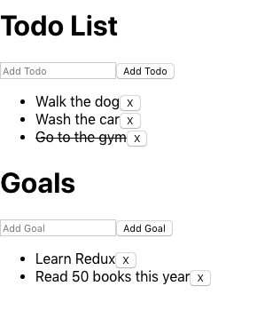

# :heavy_check_mark: To Do List and Goals with React Redux

This project was bootstrapped with [Create React App](https://github.com/facebook/create-react-app).

This project used the libraries: `react` `react-redux` `redux-thunk` and `redux`.
It was possible to learn the main concepts of using React-Redux.

## Features

- Add ToDos
- Toggle ToDos
- Remove ToDos
- Add Goals
- Remove Goals

Based on the Udacity course.

## Available Scripts

In the project directory, you can run:

### `npm start`

Runs the app in the development mode. 
Open [http://localhost:3000](http://localhost:3000) to view it in the browser.

The page will reload if you make edits. 
You will also see any lint errors in the console.
